# TP1 - Definição do Problema e Planejamento Inicial

## 1. Objetivo de Desenvolvimento Sustentável

Este projeto aborda o **ODS 3 - Saúde e Bem-Estar**, que visa "assegurar uma vida saudável e promover o bem-estar para todos, em todas as idades".

### Metas do ODS 3 abordadas:
- **Meta 3.4:** Reduzir em um terço a mortalidade prematura por doenças não transmissíveis via prevenção e tratamento, promovendo saúde mental e bem-estar.
- **Meta 3.d:** Reforçar a capacidade de todos os países para alerta precoce, redução de riscos e gerenciamento de riscos nacionais e globais de saúde.

## 2. Problema

### Contexto

O automonitoramento de saúde é uma prática essencial para a prevenção de doenças crônicas e promoção do bem-estar. Entretanto, muitas pessoas enfrentam dificuldades em:

1. **Registrar consistentemente** suas atividades físicas, sono, alimentação e hidratação
2. **Visualizar tendências** de seus hábitos ao longo do tempo
3. **Manter motivação** através de métricas como streaks de atividade
4. **Integrar dados** de diferentes aspectos da saúde em uma única ferramenta

### Problema Específico

Usuários que preferem ferramentas de linha de comando (desenvolvedores, usuários avançados de Linux/Unix) carecem de uma solução leve, privada e extensível para rastreamento de saúde pessoal que:

- Funcione offline e respeite a privacidade do usuário (dados locais)
- Seja facilmente integrável com scripts e automações
- Permita entrada rápida de dados via terminal
- Ofereça visualização opcional através de dashboard

## 3. Solução Proposta

### Tipo de Solução

**CLI (Command-Line Interface) com Dashboard opcional** desenvolvida em Rust.

### Justificativa da Escolha

| Critério | Justificativa |
|----------|---------------|
| **Privacidade** | Dados armazenados localmente em SQLite, sem dependência de serviços em nuvem |
| **Performance** | Rust oferece execução rápida e baixo consumo de recursos |
| **Portabilidade** | Compilação estática permite execução em qualquer sistema Unix-like |
| **Extensibilidade** | Arquitetura daemon/cliente permite integrações futuras |
| **Público-alvo** | Desenvolvedores e usuários técnicos que preferem CLI |
| **Adequação acadêmica** | Demonstra conhecimentos em arquitetura de software, IPC, persistência e UI |

### Componentes da Solução

1. **healthctl** - CLI principal para interação do usuário
2. **healthctl-daemon** - Daemon que gerencia persistência SQLite
3. **healthctl-lib** - Biblioteca compartilhada com tipos e lógica comum
4. **healthctl-dashboard** - Interface gráfica opcional (Tauri)

## 4. Requisitos Funcionais

| ID | Requisito | Prioridade | Status |
|----|-----------|------------|--------|
| RF01 | Registrar eventos de atividade física (corrida, caminhada, ciclismo, natação, etc.) com métricas (duração, distância, calorias, passos) | Alta | Implementado |
| RF02 | Registrar eventos de treino de força com séries, repetições e peso | Alta | Implementado |
| RF03 | Registrar eventos de sono com horário de início e fim | Alta | Implementado |
| RF04 | Registrar eventos de nutrição com macronutrientes (proteína, carboidratos, gordura) | Alta | Implementado |
| RF05 | Registrar eventos de hidratação com volume | Alta | Implementado |
| RF06 | Registrar ingestão de substâncias/suplementos | Média | Implementado |
| RF07 | Registrar atividades de saúde mental (meditação, relaxamento, journaling) | Média | Implementado |
| RF08 | Listar eventos com filtros por tipo, data, tags | Alta | Implementado |
| RF09 | Editar eventos existentes via editor de texto ($EDITOR) | Média | Implementado |
| RF10 | Clonar eventos existentes com modificações | Média | Implementado |
| RF11 | Remover eventos | Alta | Implementado |
| RF12 | Exibir status diário com resumo de atividades | Alta | Implementado |
| RF13 | Gerar relatórios por período (dia, semana, mês, ano) | Alta | Implementado |
| RF14 | Calcular e exibir streak de atividades consecutivas | Média | Implementado |
| RF15 | Gerenciar daemon (iniciar, parar, status) | Alta | Implementado |
| RF16 | Visualizar dados em dashboard gráfico | Média | Implementado |
| RF17 | Alternar tema claro/escuro no dashboard | Baixa | Implementado |
| RF18 | Deletar eventos pelo dashboard | Média | Implementado |
| RF19 | Navegar por semanas no dashboard | Média | Implementado |
| RF20 | Exibir detalhes expandidos das métricas no dashboard | Baixa | Implementado |

## 5. Requisitos Não Funcionais

| ID | Requisito | Categoria | Métrica |
|----|-----------|-----------|---------|
| RNF01 | O sistema deve responder a comandos CLI em menos de 100ms | Desempenho | Tempo de resposta < 100ms |
| RNF02 | O daemon deve suportar múltiplas conexões simultâneas | Escalabilidade | Mínimo 5 conexões concorrentes |
| RNF03 | Os dados devem ser persistidos localmente em SQLite | Segurança/Privacidade | Sem transmissão externa de dados |
| RNF04 | O sistema deve funcionar offline | Disponibilidade | 100% funcional sem internet |
| RNF05 | O código deve compilar nas versões estáveis do Rust | Portabilidade | Rust stable 1.75+ |
| RNF06 | O sistema deve suportar integração com systemd (socket activation) | Usabilidade | Socket activation funcional |
| RNF07 | A documentação deve estar em Markdown no repositório | Manutenibilidade | Docs atualizados em /docs |
| RNF08 | O código deve seguir as convenções de estilo do Rust (rustfmt) | Manutenibilidade | Zero warnings de formatação |
| RNF09 | O dashboard deve ser responsivo em diferentes resoluções | Usabilidade | Suporte 1024x768 a 4K |
| RNF10 | O sistema deve usar menos de 50MB de RAM em operação normal | Desempenho | RSS < 50MB |

## 6. Diagrama de Casos de Uso

```mermaid
graph TB
    subgraph Atores
        U[Usuário]
    end
    
    subgraph "Sistema healthctl"
        subgraph "Gestão de Eventos"
            UC01[Registrar Evento de Atividade]
            UC02[Registrar Evento de Sono]
            UC03[Registrar Evento de Nutrição]
            UC04[Registrar Evento de Hidratação]
            UC05[Registrar Evento de Substância]
            UC06[Registrar Evento de Saúde Mental]
            UC07[Registrar Treino de Força]
        end
        
        subgraph "Consultas"
            UC08[Listar Eventos]
            UC09[Visualizar Status Diário]
            UC10[Gerar Relatório]
            UC11[Visualizar Streak]
        end
        
        subgraph "Manutenção"
            UC12[Editar Evento]
            UC13[Clonar Evento]
            UC14[Remover Evento]
            UC15[Mostrar Detalhes do Evento]
        end
        
        subgraph "Sistema"
            UC16[Gerenciar Daemon]
        end
        
        subgraph "Dashboard"
            UC17[Visualizar Dashboard]
            UC18[Navegar por Semanas]
            UC19[Alternar Tema]
            UC20[Deletar Evento via Dashboard]
        end
    end
    
    U --> UC01
    U --> UC02
    U --> UC03
    U --> UC04
    U --> UC05
    U --> UC06
    U --> UC07
    U --> UC08
    U --> UC09
    U --> UC10
    U --> UC11
    U --> UC12
    U --> UC13
    U --> UC14
    U --> UC15
    U --> UC16
    U --> UC17
    U --> UC18
    U --> UC19
    U --> UC20
```

## 7. Descrição dos Casos de Uso

### UC01 - Registrar Evento de Atividade

| Campo | Descrição |
|-------|-----------|
| **Ator** | Usuário |
| **Pré-condição** | Daemon em execução |
| **Fluxo Principal** | 1. Usuário executa comando `healthctl add activity <tipo>` com parâmetros opcionais (--duration, --distance, --calories, --steps)   2. Sistema valida os dados   3. Sistema persiste o evento   4. Sistema confirma o registro |
| **Fluxo Alternativo** | Se tipo inválido, sistema exibe erro com tipos válidos |
| **Pós-condição** | Evento registrado no banco de dados |

### UC02 - Registrar Evento de Sono

| Campo | Descrição |
|-------|-----------|
| **Ator** | Usuário |
| **Pré-condição** | Daemon em execução |
| **Fluxo Principal** | 1. Usuário executa `healthctl add sleep --start <hora> --end <hora>`   2. Sistema calcula duração   3. Sistema persiste o evento   4. Sistema confirma o registro |
| **Fluxo Alternativo** | Se horários inválidos, sistema exibe erro |
| **Pós-condição** | Evento de sono registrado |

### UC08 - Listar Eventos

| Campo | Descrição |
|-------|-----------|
| **Ator** | Usuário |
| **Pré-condição** | Daemon em execução |
| **Fluxo Principal** | 1. Usuário executa `healthctl list` com filtros opcionais (--day, --week, --from, --to, --tag)   2. Sistema consulta eventos   3. Sistema exibe lista formatada |
| **Pós-condição** | Lista de eventos exibida |

### UC10 - Gerar Relatório

| Campo | Descrição |
|-------|-----------|
| **Ator** | Usuário |
| **Pré-condição** | Daemon em execução; eventos existentes |
| **Fluxo Principal** | 1. Usuário executa `healthctl report <período>`   2. Sistema agrega dados do período   3. Sistema calcula médias e totais   4. Sistema exibe relatório formatado |
| **Pós-condição** | Relatório exibido |

### UC14 - Remover Evento

| Campo | Descrição |
|-------|-----------|
| **Ator** | Usuário |
| **Pré-condição** | Daemon em execução; evento existente |
| **Fluxo Principal** | 1. Usuário executa `healthctl remove <id>`   2. Sistema busca evento pelo ID (ou prefixo)   3. Sistema solicita confirmação   4. Usuário confirma   5. Sistema remove evento   6. Sistema confirma remoção |
| **Fluxo Alternativo** | Se flag -y, pula confirmação. Se ID ambíguo, exibe erro. |
| **Pós-condição** | Evento removido do banco de dados |

### UC17 - Visualizar Dashboard

| Campo | Descrição |
|-------|-----------|
| **Ator** | Usuário |
| **Pré-condição** | Daemon em execução |
| **Fluxo Principal** | 1. Usuário abre o dashboard   2. Sistema carrega dados da semana atual   3. Sistema exibe resumo semanal, gráficos e lista de atividades   4. Usuário interage com cards para ver detalhes |
| **Pós-condição** | Dashboard exibido com dados atualizados |

## 8. Planejamento dos Sprints

### Histórico de Sprints (Retroativo)

| Sprint | Período | Entregas |
|--------|---------|----------|
| TP1 | Semana 1-2 | Definição do problema, requisitos, diagrama de casos de uso |
| TP2 | Semana 3-4 | Arquitetura C4, escolhas tecnológicas, projeto de software |
| TP3 | Semana 5-6 | CLI básico, daemon, persistência SQLite, comandos add/list/status |
| TP4 | Semana 7-8 | Dashboard Tauri, plano de testes, comandos edit/remove/clone |
| TP5 | Semana 9-10 | Streak, temas, execução de testes, refinamentos |
| TP6 | Semana 11-12 | Entrega final, documentação revisada, vídeo de demonstração |

### Backlog para TP6 (Tarefas Futuras)

- Integração com dispositivos wearables (Fitbit, Garmin)
- Exportação de dados (CSV, JSON)
- Metas e objetivos personalizados
- Notificações e lembretes
- Sincronização entre dispositivos

## 9. Nota sobre Metodologia

Este documento foi preenchido retroativamente após o desenvolvimento do projeto, seguindo os requisitos do trabalho prático. O GitHub Projects foi configurado para refletir a organização dos sprints conforme descrito. Esta abordagem demonstra a capacidade de documentar e organizar um projeto de software seguindo práticas de Engenharia de Software, mesmo quando aplicadas retrospectivamente.

---

**Próximo:** [Arquitetura do Sistema (C4 Model)](./arquitetura.md)
