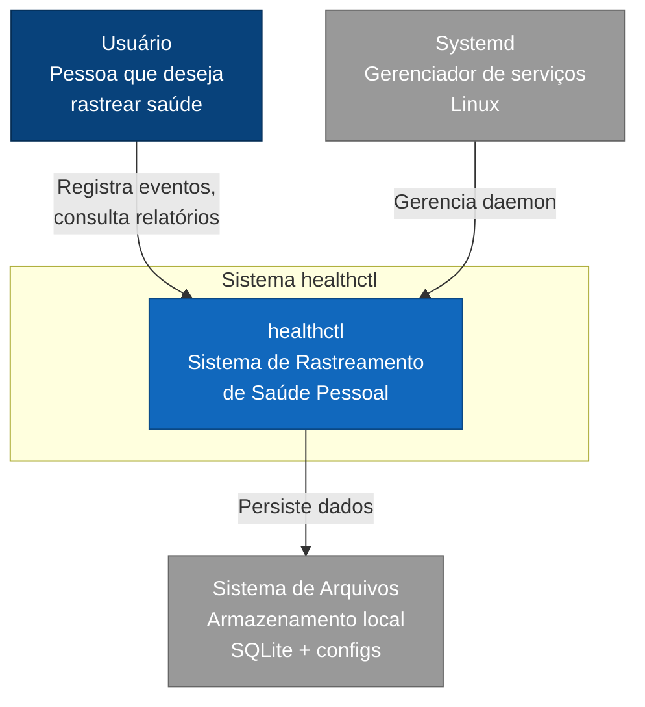
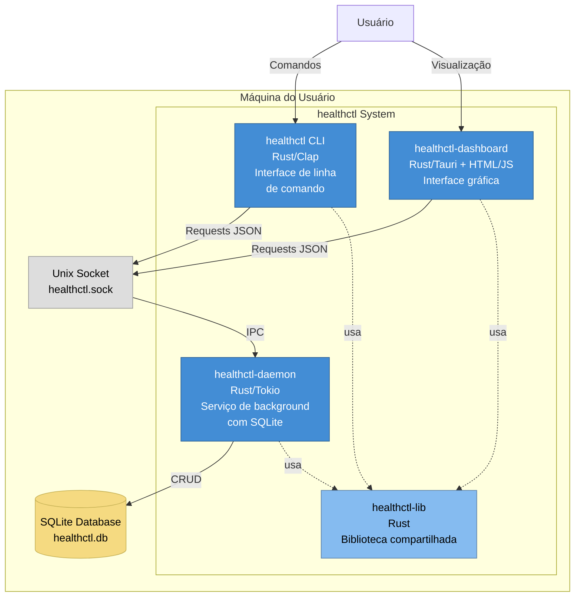
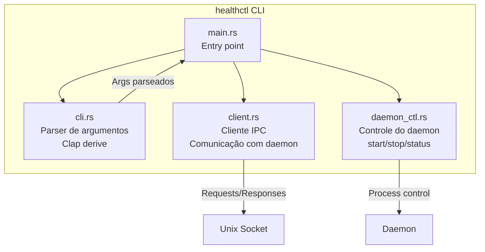
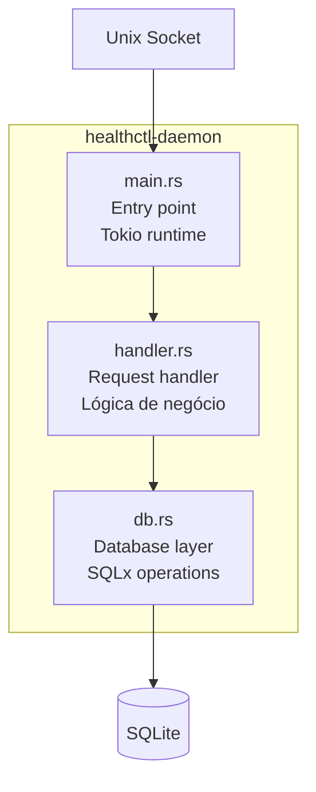
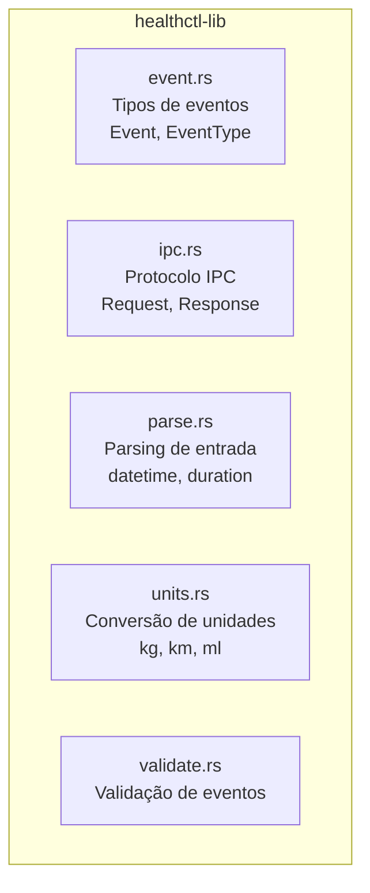
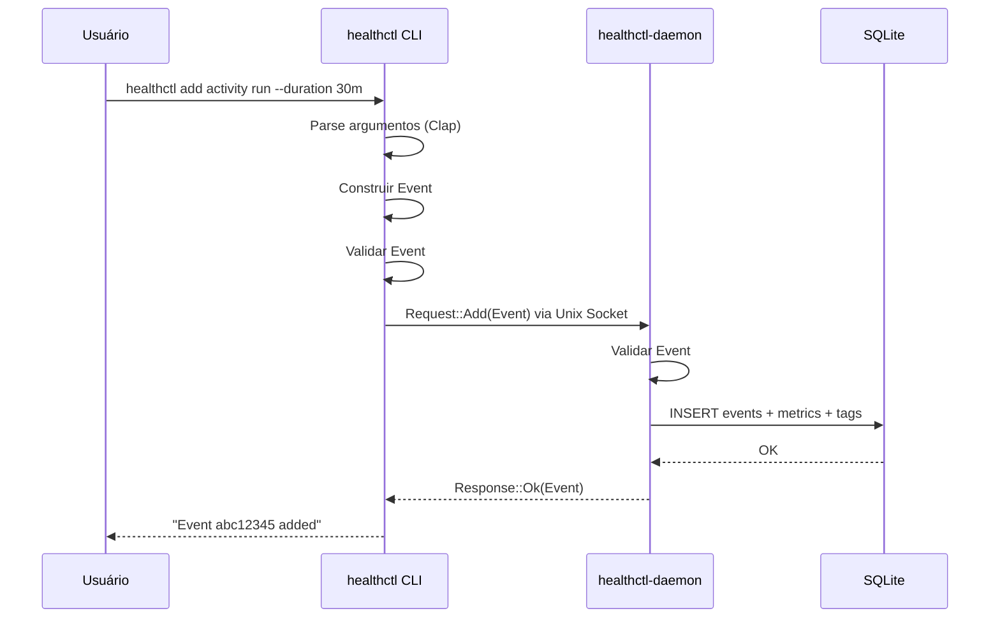
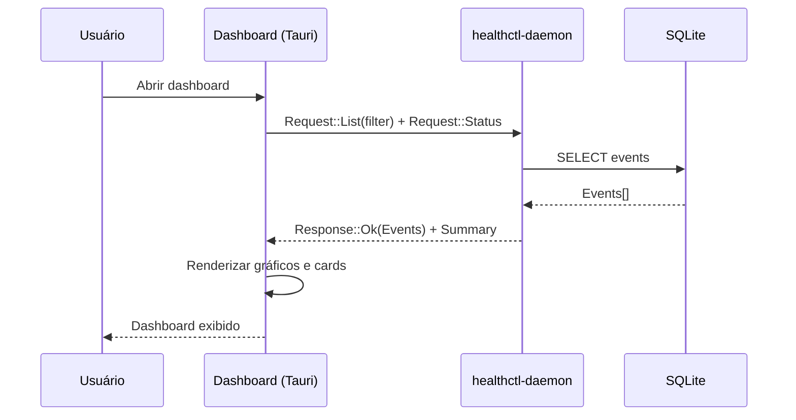

# TP2 - Arquitetura do Sistema

## 1. Visão Geral

Este documento descreve a arquitetura do sistema **healthctl** utilizando o modelo C4 (Context, Containers, Components, Code). A arquitetura foi projetada para ser modular, extensível e aderente aos princípios de software UNIX.

## 2. Escolhas Tecnológicas

### 2.1 Linguagem: Rust

| Aspecto | Justificativa |
|---------|---------------|
| **Segurança de memória** | Eliminação de bugs de memória em tempo de compilação |
| **Performance** | Execução comparável a C/C++ sem garbage collector |
| **Ecossistema moderno** | Cargo, crates.io, tooling maduro |
| **Concorrência** | Modelo de ownership previne data races |
| **Compilação estática** | Binários autocontidos, fácil distribuição |

### 2.2 Persistência: SQLite

| Aspecto | Justificativa |
|---------|---------------|
| **Sem servidor** | Não requer instalação de SGBD externo |
| **Portabilidade** | Arquivo único, fácil backup |
| **ACID** | Transações completas |
| **Performance** | Excelente para workloads de leitura/escrita local |
| **WAL Mode** | Write-Ahead Logging para melhor concorrência |

### 2.3 IPC: Unix Domain Sockets

| Aspecto | Justificativa |
|---------|---------------|
| **Performance** | Mais rápido que TCP para comunicação local |
| **Segurança** | Permissões de filesystem |
| **Simplicidade** | API similar a sockets TCP |
| **Systemd** | Suporte a socket activation |

### 2.4 CLI: Clap

| Aspecto | Justificativa |
|---------|---------------|
| **Derive macros** | Definição declarativa de argumentos |
| **Completions** | Geração automática de autocomplete |
| **Help gerado** | Documentação automática |
| **Validação** | Tipos e constraints em tempo de compilação |

### 2.5 Dashboard: Tauri

| Aspecto | Justificativa |
|---------|---------------|
| **Tamanho** | Binário menor que Electron (~10MB vs ~100MB) |
| **Performance** | Backend em Rust, frontend em HTML/CSS/JS |
| **Segurança** | Sem Node.js runtime, menor superfície de ataque |
| **Multiplataforma** | Linux, macOS, Windows |

### 2.6 Async Runtime: Tokio

| Aspecto | Justificativa |
|---------|---------------|
| **Performance** | Runtime assíncrono de alta performance |
| **Ecossistema** | Integração com SQLx, Tauri |
| **Maturidade** | Amplamente utilizado em produção |

## 3. Modelo C4

### 3.1 Nível 1: Contexto do Sistema



**Descrição:** O sistema healthctl é utilizado por um usuário para rastrear métricas de saúde pessoal. Os dados são armazenados localmente em SQLite. O systemd pode gerenciar o ciclo de vida do daemon.

### 3.2 Nível 2: Diagrama de Containers



**Containers:**

| Container | Tecnologia | Responsabilidade |
|-----------|------------|------------------|
| **healthctl CLI** | Rust + Clap | Interface principal do usuário, parsing de comandos, formatação de output |
| **healthctl-daemon** | Rust + Tokio + SQLx | Persistência, lógica de negócio, servidor IPC |
| **healthctl-dashboard** | Rust + Tauri | Interface gráfica, visualização de dados |
| **healthctl-lib** | Rust | Tipos compartilhados, validação, serialização |
| **SQLite Database** | SQLite 3 | Persistência de eventos e métricas |
| **Unix Socket** | Unix Domain Socket | Canal de comunicação IPC |

### 3.3 Nível 3: Componentes

#### 3.3.1 healthctl CLI



#### 3.3.2 healthctl-daemon



#### 3.3.3 healthctl-lib



### 3.4 Nível 4: Código

#### 3.4.1 Modelo de Dados (Event)

```rust
pub struct Event {
    pub id: Uuid,
    pub event_type: EventType,
    pub start_time: Option<DateTime<Utc>>,
    pub end_time: Option<DateTime<Utc>>,
    pub metrics: HashMap<String, f64>,
    pub tags: Vec<String>,
    pub exercises: Vec<Exercise>,
    pub created_at: DateTime<Utc>,
}

pub enum EventType {
    Activity(ActivityKind),
    Strength,
    Sleep,
    Nutrition,
    Hydration,
    Substance,
    Mental(MentalKind),
}
```

#### 3.4.2 Protocolo IPC

```rust
pub enum Request {
    Add(Event),
    Get { id: Uuid },
    GetByPrefix { prefix: String },
    Delete { id: Uuid },
    Update(Event),
    List(ListFilter),
    Status,
    Report { period: ReportPeriod },
    Shutdown,
    Ping,
}

pub enum Response {
    Ok(ResponseData),
    Error { message: String },
}
```

#### 3.4.3 Schema do Banco de Dados

```sql
CREATE TABLE events (
    id TEXT PRIMARY KEY,
    event_type TEXT NOT NULL,
    start_time TEXT,
    end_time TEXT,
    created_at TEXT NOT NULL
);

CREATE TABLE event_metrics (
    event_id TEXT NOT NULL,
    key TEXT NOT NULL,
    value REAL NOT NULL,
    PRIMARY KEY (event_id, key),
    FOREIGN KEY (event_id) REFERENCES events(id) ON DELETE CASCADE
);

CREATE TABLE event_tags (
    event_id TEXT NOT NULL,
    tag TEXT NOT NULL,
    PRIMARY KEY (event_id, tag),
    FOREIGN KEY (event_id) REFERENCES events(id) ON DELETE CASCADE
);

CREATE TABLE event_exercises (
    id INTEGER PRIMARY KEY AUTOINCREMENT,
    event_id TEXT NOT NULL,
    name TEXT NOT NULL,
    sets INTEGER,
    reps INTEGER,
    weight_kg REAL,
    FOREIGN KEY (event_id) REFERENCES events(id) ON DELETE CASCADE
);
```

## 4. Decisões Arquiteturais

### 4.1 Arquitetura Daemon/Cliente

**Decisão:** Separar a lógica de persistência em um daemon dedicado.

**Justificativa:**
- Permite múltiplos clientes (CLI, dashboard) acessarem os mesmos dados
- Evita locks de arquivo SQLite
- Habilita socket activation do systemd
- Facilita futura implementação de notificações/lembretes

### 4.2 Unidades SI Internamente

**Decisão:** Armazenar todas as métricas em unidades SI (kg, metros, segundos).

**Justificativa:**
- Consistência no banco de dados
- Conversões feitas apenas na entrada/saída
- Facilita agregações e comparações

### 4.3 Derivação de Duração

**Decisão:** Não armazenar duração, apenas start_time e end_time.

**Justificativa:**
- Evita inconsistências
- Duração sempre derivada: `end_time - start_time`
- Usuário pode informar duração na entrada, sistema calcula os tempos

### 4.4 IDs como UUIDs

**Decisão:** Usar UUIDs v4 para identificação de eventos.

**Justificativa:**
- Geração distribuída sem coordenação
- Suporte a prefixos curtos para usabilidade (ex: `healthctl show abc123`)
- Evita colisões em eventual sincronização futura

## 5. Fluxos Principais

### 5.1 Fluxo de Adição de Evento



### 5.2 Fluxo do Dashboard



## 6. Considerações de Segurança

| Aspecto | Medida |
|---------|--------|
| **Dados locais** | Nenhum dado é transmitido externamente |
| **Permissões de socket** | Socket em $XDG_RUNTIME_DIR com permissões do usuário |
| **Validação de entrada** | Todas as entradas são validadas antes de persistir |
| **SQL Injection** | Uso de prepared statements via SQLx |

## 7. Considerações de Escalabilidade

| Aspecto | Abordagem |
|---------|-----------|
| **Volume de dados** | SQLite suporta milhões de registros; índices em event_type e timestamps |
| **Concorrência** | WAL mode permite múltiplas leituras simultâneas |
| **Conexões** | Tokio runtime com pool de conexões (5) |

---

**Anterior:** [TP1 - Definição do Problema](./TP1.md)  
**Próximo:** [Plano de Testes](./testes.md)
